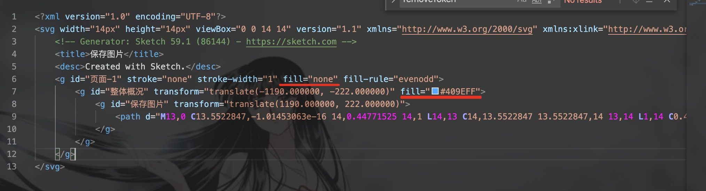

使用svg图标

<strong>1、安装`svg-sprite-loader`</strong>

    npm i -D svg-sprite-loader

<strong>2、修改配置(vue.config.js)</strong>

```javascript
module.exports = {
    chainWebpack: config => {
        //配置svg图标
        config.module.rule('svg')
            .exclude.add(path.resolve('./src/icons'))

        config.module.rule('icons')
            .test(/\.svg$/)
            .include.add(path.resolve('./src/icons')).end()
            .use('svg-sprite-loader')
            .loader('svg-sprite-loader')
            .options({ symbolId: 'icon-[name]' })
    }
}
```

<strong>3、添加SvgIcon组件</strong>

在components文件夹下添加SvgIcon.vue，代码如下

```html
<template>
  <svg :class="svgClass" v-on="$listeners">
    <use :xlink:href="iconName" />
  </svg>
</template>

<script>
export default {
  name: "SvgIcon",
  props: {
    iconClass: {
      type: String,
      required: true
    },
    className: {
      type: String,
      default: ""
    }
  },
  computed: {
    iconName() {
      return `#icon-${this.iconClass}`;
    },
    svgClass() {
      if (this.className) {
        return "svg-icon " + this.className;
      } else {
        return "svg-icon";
      }
    }
  }
};
</script>

<style scoped>
.svg-icon {
  width: 1em;
  height: 1em;
  vertical-align: -0.15em;
  fill: currentColor;
  overflow: hidden;
}
</style>
```

<strong>4、在src下创建文件夹 icons</strong>

文件目录

icons
  |-- svg
  |   |--- test.svg
  |   |--- loading.svg
  |-- index.js
  


index.js代码如下：

```javascript

import Vue from "vue";
import SvgIcon from "@components/SvgIcon.vue";

const req = require.context("./svg", false, /\.svg$/);
req.keys().map(req);

//  使用方式：
//  <svg-icon icon-class="test"></svg-icon>

//全局注册
Vue.component("svg-icon", SvgIcon);

```


<strong>4、界面应用</stronng>

```html

<svg-icon icon-class="test"></svg-icon>

//添加样式
<style>
.iconTest{color:red;font-size:16px}
</style>


```

<font color=red>注意：svg由设计提供或自己下载的时候，可能有一下fill配置，需将其移除，才可更改其颜色；如下图：</font>


