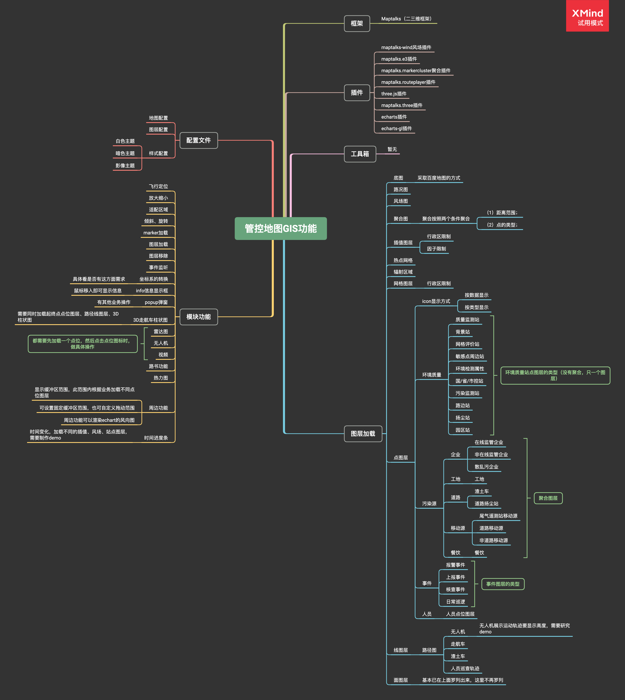

主要针对管控地图GIS功能应用场景，GIS功能从7个方面来考虑：

<strong>1、框架</strong>

<strong>2、插件</strong>

<strong>3、工具箱（暂无）</strong>

<strong>4、图层加载</strong>

<strong>5、配置文件</strong>

<strong>6、模块功能</strong>

##### GIS框架规划图

